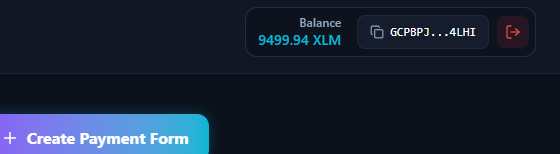

# StellarForms 🚀

> Create payment forms. Share one link. Get paid directly on Stellar.

StellarForms is a decentralized, non-custodial payment collection platform designed for creators, freelancers, and businesses. It allows anyone to generate customizable payment forms that visitors can settle directly using Stellar wallets.

Unlike traditional payment gateways, StellarForms never holds user funds—payments are settled peer-to-peer on the Stellar network while payment configuration states are managed on-chain by Soroban smart contracts.

---

## 🏆 Hackathon Submission Details (Levels 1 - 3)

This project has been built to satisfy all requirements for the **White Belt (Level 1)**, **Yellow Belt (Level 2)**, and **Orange Belt (Level 3)** submissions.

### 🌐 Live Demo & Repository

- **GitHub Repository**: `https://github.com/Uche44/stellar-forms`
- **Vercel Live Demo**: `https://stellar-forms-r8ou.vercel.app/dashboard`
  ;

### ⛓️ Deployed Smart Contracts (Stellar Testnet)

Both Soroban contracts are compiled and deployed to the Stellar Testnet:

| Contract                           | Testnet Contract ID                                        |
| ---------------------------------- | ---------------------------------------------------------- |
| **FormsContract**                  | `CDU7UXX4GFJNUIAGM4AOONMXOSL3M6AHFUMGAFJTBAR6HZOTGIK6EFET` |
| **PaymentsContract**               | `CAYUFOPVI2WJTV5BUIORCAG7QTUOFJXHA7M2Y7GIVVIE7H6KHVIW7BMO` |
| **Native XLM Token** (Testnet SAC) | `CDLZFC3SYJYDZT7K67VZ75HPJVIEUVNIXF47ZG2FB2RMQQVU2HHGCYSC` |

- **Explorer Link (Forms)**: [Stellar.expert - Forms Contract](https://stellar.expert/explorer/testnet/contract/CDU7UXX4GFJNUIAGM4AOONMXOSL3M6AHFUMGAFJTBAR6HZOTGIK6EFET)
- **Explorer Link (Payments)**: [Stellar.expert - Payments Contract](https://stellar.expert/explorer/testnet/contract/CAYUFOPVI2WJTV5BUIORCAG7QTUOFJXHA7M2Y7GIVVIE7H6KHVIW7BMO)

### 📝 Verified On-Chain Transactions

- **Create Form #1** ("Coffee Tip", 5 XLM):
  `1acd42f2468962f8be7eb1fe00bdee424382d077075858c7b7799fc094f7e5c4`
- **Process Payment** (Inter-contract query + Native payment transfer):
  `401b5b8edae4b727a8a4a1e1a7756c50a897bd762d5738fa999da502913c844d`

---

## 📸 Submission Screenshots

Please replace the placeholders below with screenshots from your live application to complete your submission:

### 1. Wallet Connection & Balance (Level 1)

- **Wallet Connected & Balance Displayed**:
  
- **Successful Testnet Transaction & Result**:
  

### 2. Multi-Wallet Options (Level 2)


### 3. Responsive UI & Infrastructure (Level 3)

- **Mobile Responsive Layout**:
  
- **CI/CD Pipeline Running**:
  _[Insert screenshot showing the GitHub Actions workflow successfully passing]_
- **Vitest Test Output (5+ Passing Tests)**:
  

---

## 🏗️ Architecture

```text
                     React Frontend (Vite)
                               │
      ┌────────────────────────┴────────────────────────┐
      │                                                 │
Stellar Wallets Kit                                 Stellar SDK
(Freighter, Albedo, xBull)                         (Horizon Client)
      │                                                 │
      └────────────────────────┬────────────────────────┘
                               │
                           Soroban RPC
                               │
              ┌─────────────────┴─────────────────┐
              │                                   │
       Forms Contract                     Payments Contract
    (Stores form schemas)               (Validates & transfers XLM)
```

1. **Multi-Wallet Integration**: Built using `@creit.tech/stellar-wallets-kit`, allowing users to select and authenticate using Freighter, Albedo, or xBull.
2. **Forms Contract**: Written in Soroban Rust SDK, responsible for managing the lifecycle of payment forms on-chain. Emits events for form creation, status toggles, and metadata updates.
3. **Payments Contract**: Interacts with the Forms Contract to verify if a given form ID is active. Once validated, it issues the payment transfer of native testnet XLM directly from the customer's wallet to the creator's wallet.
4. **Horizon API**: Used to query real-time account balances, fetch transactions, and stream payment events to update the UI instantly.

---

## 🛠️ Tech Stack

### Frontend

- **Framework**: React 18, TypeScript, Vite
- **Styling**: Tailwind CSS, PostCSS (custom glassmorphic theme)
- **Routing**: React Router DOM v7
- **State/Data Fetching**: TanStack Query (React Query)
- **Forms & Validation**: React Hook Form, Zod
- **Notifications**: React Hot Toast
- **Testing**: Vitest, React Testing Library, jsdom

### Smart Contracts

- **Language**: Rust
- **Target**: WASM (`wasm32-unknown-unknown`)
- **Framework**: Soroban SDK (v22.0.1)

---

## 🚀 Setup & Installation

### Prerequisites

- Node.js (v20+) & npm
- Rust & Cargo (to compile contracts)
- `stellar-cli` (to deploy contracts and interact via terminal)
- A browser wallet (e.g. Freighter, Albedo, xBull) configured for Stellar Testnet.

### Frontend Installation

1. Clone the repository and install the dependencies:
   ```bash
   npm install --legacy-peer-deps
   ```
2. Create your environment variables file:
   ```bash
   cp .env.example .env
   ```
3. Run the development server locally:
   ```bash
   npm run dev
   ```
4. Access the application in your browser at `http://localhost:5173`.

### Smart Contracts Development

The smart contracts are located in the `contracts/` directory.

1. Navigate to the contract folder:
   ```bash
   cd contracts
   ```
2. Build the contracts into WebAssembly:
   ```bash
   stellar contract build
   ```
3. Run the contract unit tests:
   ```bash
   cargo test
   ```

---

## 🧪 Testing

### Running Frontend Tests

Frontend tests are built using Vitest and React Testing Library:

```bash
npm run test
```

_Currently contains 5 passing tests covering landing layouts and mock storage behaviors._

### Running Rust Contract Tests

To execute contract unit tests inside the cargo workspace:

```bash
cargo test --manifest-path contracts/Cargo.toml
```

---

## ⚠️ Error Handling & UX Safety

StellarForms implements robust checks to handle blockchain transaction errors gracefully:

1. **Wallet Failures**: Catch and show toasts for rejected signatures, missing wallet extensions, or configuration errors (e.g., incorrect network).
2. **Transaction Life Cycle**: Real-time spinner indicators and toast alerts for pending, successful, and failed blockchain transaction states.
3. **Invalid Inputs**: Client-side validation using React Hook Form & Zod to block invalid Stellar public keys or negative XLM amounts before sending transaction XDRs.
